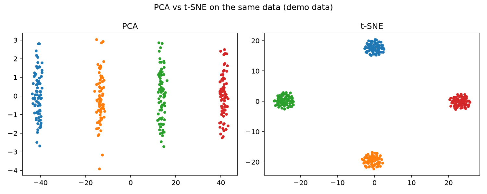

# Dimensionality Reduction Compare

PCA and t-SNE can look at the same cells and tell you different stories. Knowing what each one preserves — and quietly distorts — is the difference between insight and self-deception.

## Why This Matters

PCA keeps real distances but misses nonlinear structure. t-SNE reveals tight local clusters, but its distances *between* clusters, and even cluster sizes, are not meaningful. Seeing them side by side keeps you honest about what a plot is — and is not — actually telling you.

## How It Works

1. Reduce the same dataset with PCA and with t-SNE.
2. Plot both, coloured by the true groups.
3. Compare what each method reveals and hides.

## What the Demo Shows



The demo builds four clusters. PCA spreads them along axes of real variance; t-SNE packs them into tight, cleanly separated blobs. Same data, two lenses — a direct reminder not to over-read a t-SNE gap.

## Run It

```bash
pip install -r requirements.txt
python demo.py
```

> Demonstrated on synthetic data, so the whole thing is reproducible with no external downloads.
